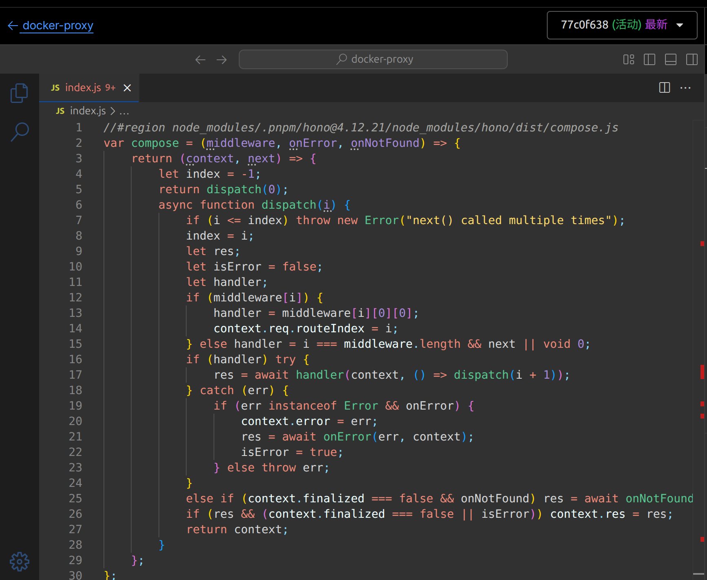
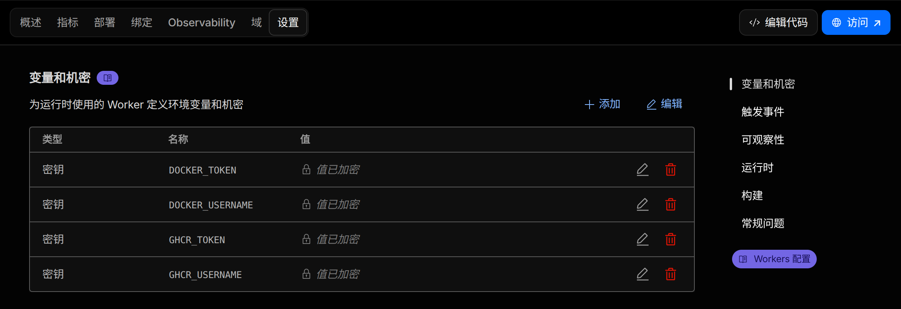

# Docker & GHCR Registry Proxy

本项目是一个基于 `Hono` 框架开发的轻量级、自托管 Docker Registry & GHCR 反向代理与加速服务。可部署于 `Cloudflare Workers`, `Deno Deploy` 上,旨在帮助国内网络环境顺利拉取容器镜像。

## ✨ 特性

- **支持私有镜像**:支持在 `Cloudflare`, `Deno Deploy` Secrets变量中托管私有 Token,从而具备拉取私有镜像的能力。

## 🚀 快速部署 (Cloudflare Workers)

1. 下载Release中打包好的 `proxy.js` 文件
2. 进入`Cloudflare Dashboard`,创建一个新的Worker,将 `proxy.js` 的内容复制粘贴到编辑器中,保存并部署。
   
3. 配置环境变量 (推荐)
   如果你需要通过代理拉取私有镜像,或者为了防止公共匿名请求触发速率限制,可以通过在平台Dashboard中设置以下密钥:

```
DOCKER_USERNAME / DOCKER_TOKEN
GHCR_USERNAME / GHCR_TOKEN
```



## 📖 使用教程

假设你部署后的代理服务域名为: `proxy.sanbei.codes`

场景 1:拉取 Docker Hub镜像

```
docker pull proxy.sanbei.codes/nginx:latest
```

场景2: 拉取 GHCR镜像

```
docker pull proxy.sanbei.codes/ghcr.io/sanbei101/im:latest
```

## 🧱 源码结构与原理说明

```
config.ts: 定义了支持的远程上游注册表主机,如 registry-1.docker.io、ghcr.io以及它们各自对应的 Auth 鉴权服务器地址
utils.ts: 核心逻辑工具包。包含Docker V2 路由解析器,负责拆解请求并补全 library/ 缺省空间;同时包含了 Docker Registry V2 认证挑战处理器,用于解析 WWW-Authenticate 头部并生成新的认证请求URL
index.ts: Hono 路由的主入口。拦截所有 /v2/\* 请求,执行边缘 Fetch 转发,并代理完成 401 身份验证挑战重试。
```
